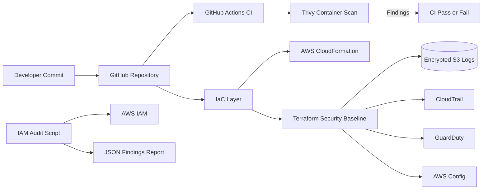

<h1 align="center">☁️🔐 Cloud Security Engineer Portfolio</h1>

  
  
  
  
  

  

## Overview

This repository is a hands-on cloud security portfolio focused on AWS security engineering, secure cloud adoption, infrastructure-as-code, IAM hardening, logging/monitoring, and DevSecOps automation.

The goal is to show practical security work that maps to real cloud environments: identifying risky permissions, building secure baselines, creating detection visibility, and adding security gates into engineering workflows.

## Cloud Security Focus Areas

- IAM least privilege and identity risk review
- Infrastructure-as-Code security using Terraform and CloudFormation
- AWS security monitoring and logging controls
- DevSecOps pipeline security with container vulnerability scanning
- Evidence-based security reporting and remediation tracking

## High-Level Security Architecture

## Projects Included

### 1. AWS CloudFormation & S3 Management

A foundational AWS project focused on creating, updating, and deleting infrastructure using CloudFormation. The project demonstrates secure and repeatable infrastructure management using AWS S3, EC2, VPC, and stack lifecycle operations.

**Skills shown:** AWS CloudFormation, S3, EC2, VPC, infrastructure lifecycle management, IaC basics

### 2. IAM Least-Privilege Audit

A Python-based IAM audit script that reviews AWS identities for common security risks such as missing MFA, old access keys, wildcard actions, wildcard resources, and high-risk administrative permissions.

**Path:** `projects/iam-least-privilege-audit/`

**Skills shown:** IAM policy review, Python automation, Boto3, access risk identification, JSON reporting

### 3. AWS Security Baseline with Terraform

A Terraform project that builds a basic AWS security baseline with centralized encrypted logging, CloudTrail, GuardDuty, and AWS Config support.

**Path:** `projects/aws-security-baseline-terraform/`

**Skills shown:** Terraform, AWS security services, logging controls, governance readiness, detection visibility

### 4. Container Security CI Pipeline

A GitHub Actions workflow that builds a container image and scans it with Trivy. The pipeline fails when high or critical vulnerabilities are found, helping prevent insecure images from moving forward.

**Path:** `projects/container-security-ci/`

**Workflow:** `.github/workflows/container-security.yml`

**Skills shown:** DevSecOps, GitHub Actions, Trivy, vulnerability gating, container security

## Why This Portfolio Matters

This repo is built to show more than basic cloud knowledge. It shows security thinking across the full workflow:

- Prevent: IAM least privilege and IaC security baselines
- Detect: CloudTrail, GuardDuty, AWS Config, and audit reports
- Respond: JSON findings that can support remediation tracking
- Shift left: CI/CD security checks before deployment

## Next Improvements

- Add Checkov or tfsec scanning for Terraform security review
- Add Security Hub and EventBridge alerting examples
- Add sample findings screenshots and remediation notes
- Add an EKS or Kubernetes security mini-lab
- Add a more detailed architecture diagram for each project

## Tech Stack

| Area | Tools / Services |
|---|---|
| Cloud | AWS IAM, S3, EC2, VPC, CloudTrail, GuardDuty, AWS Config |
| IaC | Terraform, AWS CloudFormation |
| Automation | Python, Boto3 |
| DevSecOps | GitHub Actions, Trivy |
| Reporting | JSON findings, security documentation |
